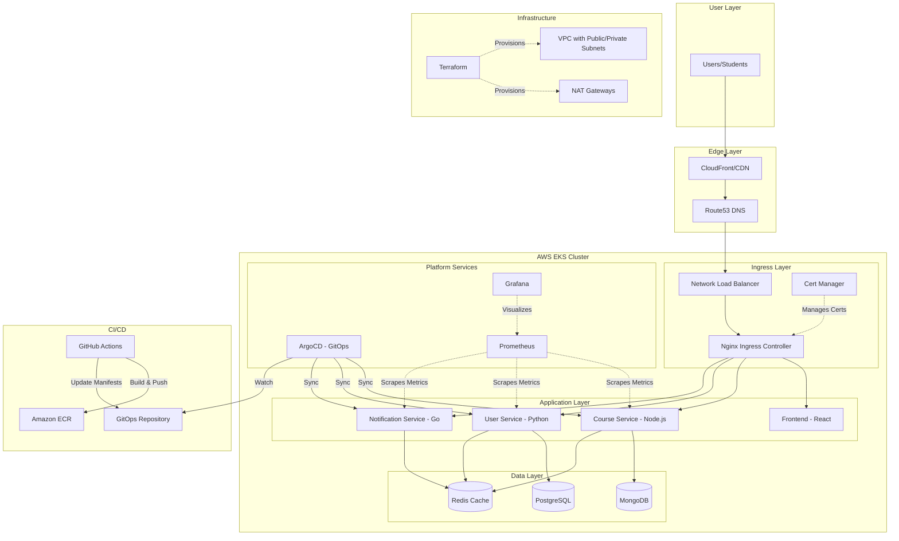
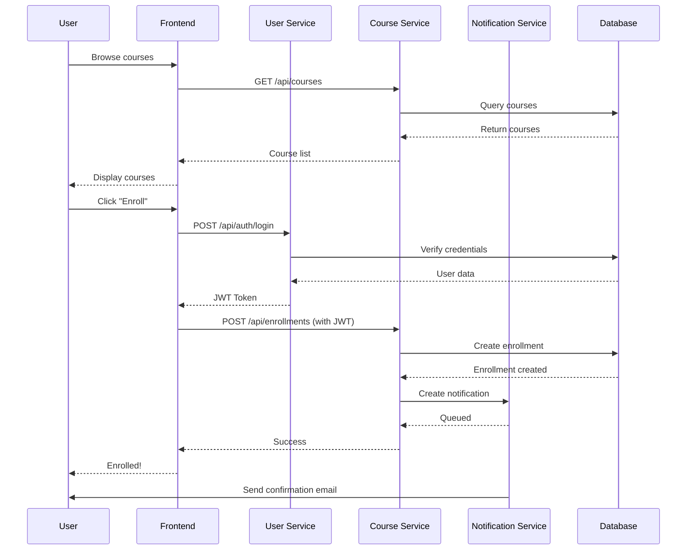
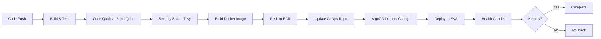

# Learning Platform Architecture

## System Overview

The Learning Platform is a cloud-native, microservices-based application designed for scalability, reliability, and maintainability.

## High-Level Architecture



## Component Details

### Frontend (React)

- **Technology**: React 18, Nginx
- **Purpose**: User interface for browsing and enrolling in courses
- **Features**: 
  - Course catalog
  - User authentication
  - Responsive design
  - SEO optimized

### Course Service (Node.js/TypeScript)

- **Technology**: Express.js, MongoDB, Redis
- **Purpose**: Manage course data and operations
- **API Endpoints**:
  - `GET /api/courses` - List courses with pagination
  - `GET /api/courses/:id` - Get course details
  - `POST /api/courses` - Create course
  - `PUT /api/courses/:id` - Update course
  - `DELETE /api/courses/:id` - Delete course
- **Features**:
  - Redis caching for performance
  - Full-text search
  - Category filtering
  - Prometheus metrics

### User Service (Python/Flask)

- **Technology**: Flask, PostgreSQL, Redis
- **Purpose**: User authentication and management
- **API Endpoints**:
  - `POST /api/auth/register` - User registration
  - `POST /api/auth/login` - User login
  - `GET /api/users` - List users
  - `GET /api/users/:id` - Get user details
  - `PUT /api/users/:id` - Update user
- **Features**:
  - JWT-based authentication
  - Password hashing with bcrypt
  - Role-based access control
  - Session management with Redis

### Notification Service (Go)

- **Technology**: Go, Redis
- **Purpose**: Handle notifications (email, SMS, push)
- **API Endpoints**:
  - `POST /api/notifications` - Create notification
  - `GET /api/notifications/:id` - Get notification status
- **Features**:
  - Asynchronous processing
  - Multiple delivery channels
  - Retry logic
  - Status tracking

## Data Flow

### User Enrollment Flow



## Infrastructure Architecture

### Network Topology

```
AWS Region (us-east-1)
│
├── VPC (10.0.0.0/16)
│   ├── Public Subnets (10.0.0.0/24, 10.0.1.0/24, 10.0.2.0/24)
│   │   ├── NAT Gateways
│   │   └── Network Load Balancer
│   │
│   └── Private Subnets (10.0.100.0/24, 10.0.101.0/24, 10.0.102.0/24)
│       ├── EKS Node Groups
│       ├── Application Pods
│       └── Database Pods
│
├── Internet Gateway (for public subnets)
└── Route Tables
    ├── Public Route Table → Internet Gateway
    └── Private Route Tables → NAT Gateway
```

### Security Architecture

1. **Network Security**:
   - Private subnets for all application workloads
   - Network ACLs and Security Groups
   - VPC Flow Logs for audit

2. **Pod Security**:
   - Run as non-root user
   - Read-only root filesystem where possible
   - Drop all capabilities
   - Security contexts enforced

3. **Secrets Management**:
   - Kubernetes Secrets (encrypted at rest)
   - AWS Secrets Manager integration (optional)
   - No secrets in Git repositories

4. **RBAC**:
   - Least privilege principle
   - Namespace isolation
   - Service account per application

## CI/CD Pipeline

### Pipeline Stages



### Quality Gates

1. **Build Stage**: Unit tests must pass (>80% coverage)
2. **Code Quality**: SonarQube quality gate (no critical issues)
3. **Security**: No high/critical vulnerabilities in dependencies or images
4. **Deployment**: Health checks must pass

## Monitoring & Observability

### Metrics Collected

- **Infrastructure**: CPU, memory, disk, network
- **Application**: Request rate, latency, error rate
- **Business**: Course enrollments, user signups, active users
- **Database**: Connection pool, query performance

### Alerting Rules

- Pod restart > 3 times in 5 minutes
- Error rate > 5% for 2 minutes
- CPU usage > 80% for 5 minutes
- Memory usage > 90%
- Certificate expiring in < 7 days

## Disaster Recovery

### Backup Strategy

- **Databases**: Daily backups to S3 (retained for 30 days)
- **Kubernetes State**: Velero backups every 6 hours
- **Infrastructure**: Terraform state in S3 with versioning

### RTO and RPO

- **Recovery Time Objective (RTO)**: 4 hours
- **Recovery Point Objective (RPO)**: 24 hours

### Recovery Procedures

1. Restore infrastructure from Terraform
2. Restore database from latest backup
3. Deploy applications via ArgoCD
4. Verify functionality
5. Update DNS

## Scalability

### Horizontal Scaling

- HPA configured for all services
- Scale based on CPU/memory thresholds
- Cluster Autoscaler for node scaling

### Vertical Scaling

- Resource limits defined per service
- Can update resource requests/limits via Helm

### Database Scaling

- MongoDB: Replica sets for read scaling
- PostgreSQL: Read replicas (future enhancement)
- Redis: Cluster mode for horizontal scaling

## Technology Stack Summary

| Layer | Technology |
|-------|-----------|
| **Frontend** | React, Nginx |
| **Backend Services** | Node.js, Python, Go |
| **Databases** | MongoDB, PostgreSQL, Redis |
| **Container Orchestration** | Kubernetes (EKS) |
| **CI/CD** | GitHub Actions |
| **GitOps** | ArgoCD |
| **IaC** | Terraform |
| **Monitoring** | Prometheus, Grafana |
| **Ingress** | Nginx Ingress Controller |
| **TLS** | cert-manager, Let's Encrypt |
| **Cloud** | AWS (VPC, EKS, ECR, Route53) |

## Security Compliance

- **HTTPS Only**: All traffic encrypted in transit
- **Secrets Encryption**: At rest and in transit
- **Audit Logging**: All API calls logged
- **Network Policies**: Pod-to-pod communication restricted
- **Image Scanning**: Vulnerabilities detected before deployment
- **RBAC**: Fine-grained access control
